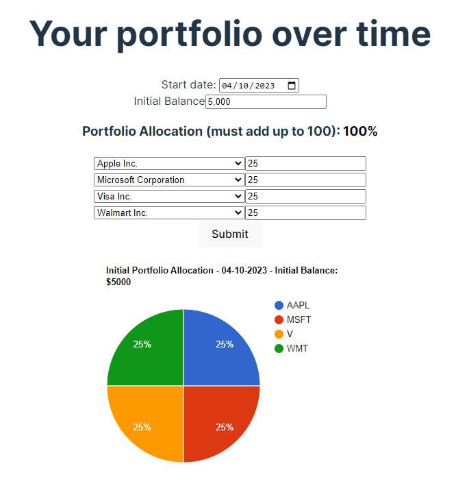

# Historical Portfolio

Want to see how the value of your stock portfolio has changed over time? Historical Portfolio's got your back.

Built in React, this simple website allows you to choose your stocks, choose how much of your initial balance was allocated to each stock, and then see how much the value of your investments have changed over time.

[Here's](https://youtu.be/eDzOpBmo-EI) a demo of the app.

You can access the website [here](https://historical-portfolio.vercel.app/).

Enjoy!
